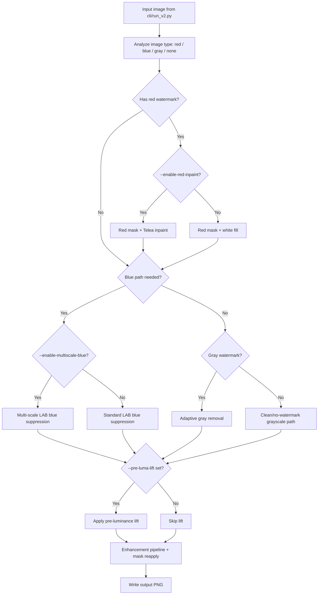

# Watermark Removal Documentation

## Problem Statement

We process scanned study-material images that often contain:

- colored watermarks (blue / red / gray), and
- low-contrast backgrounds.

Goal:

- remove watermark artifacts,
- preserve text/diagram strokes,
- keep output readable and clean,
- support both single-image and batch processing.

## V1 Solution

Code: `src/remove_watermark.py`

V1 pipeline:

1. Detect/remove red watermark pixels (HSV mask).
2. Convert to grayscale.
3. Use histogram + LUT to push bright watermark regions toward white.
4. Apply contrast stretch + sharpening.

Strengths:

- Simple and fast.

Limitations:

- Limited handling of faint large blue watermarks.
- No per-image strategy tuning.
- Can leave residue or over-process some pages.

## V2 Solution

Code: `src/remove_watermark_v2.py`

V2 improves robustness with:

- per-image watermark analysis/classification,
- LAB-based blue watermark suppression,
- adaptive grayscale/thresholding path for non-blue cases,
- optional red-region inpainting,
- stronger post-enhancement controls.

Result:

- better preservation of line/text content,
- better cleanup of mixed watermark cases,
- more control via CLI flags.

## How to Use V2 (and When to Use Which Flags)

CLI entrypoint: `cli/run_v2.py`

### Basic usage

- Single image:
  - `uv run cli/run_v2.py samples/watermarked/wm_060.jpg final_output`
- Batch folder:
  - `uv run cli/run_v2.py samples/watermarked final_output_batch`

### Use all modes together

- `uv run cli/run_v2.py samples/watermarked/wm_060.jpg final_output --enable-multiscale-blue --enable-red-inpaint --pre-luma-lift`
- `uv run cli/run_v2.py samples/watermarked/wm_060.jpg final_output --enable-multiscale-blue --enable-red-inpaint --pre-luma-lift 238`

### V2 processing flow (with or without flags)

### Flag guide (when to use)

- `--enable-multiscale-blue`
  - Use when the page has faint, large-area blue cast/watermark that normal mode misses.
- `--enable-red-inpaint`
  - Use when visible red text/logo watermark exists; inpainting usually removes red regions more naturally.
- `--pre-luma-lift [value]`
  - Use when background remains gray/dirty.
  - Allowed range: `220` to `250`; `0` means off.
  - If flag is given without value, default is `235`.

### Practical recommendation

- Start with no flags.
- Add only the flags needed for that image set:
  1. red artifacts -> `--enable-red-inpaint`
  2. faint blue residue -> `--enable-multiscale-blue`
  3. dull/gray background -> `--pre-luma-lift` (start at `235`, tune `230-245`).
